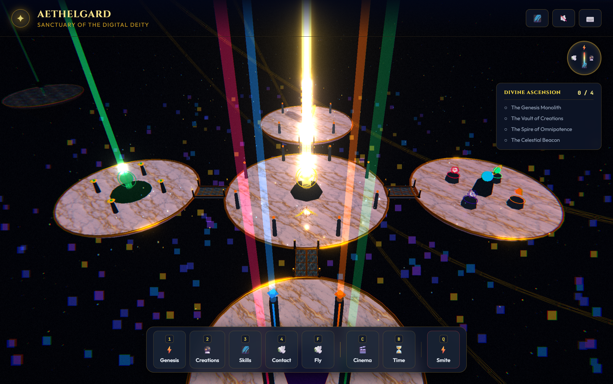
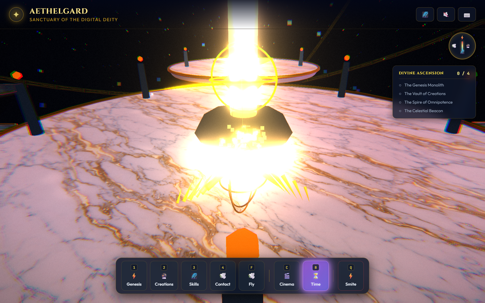
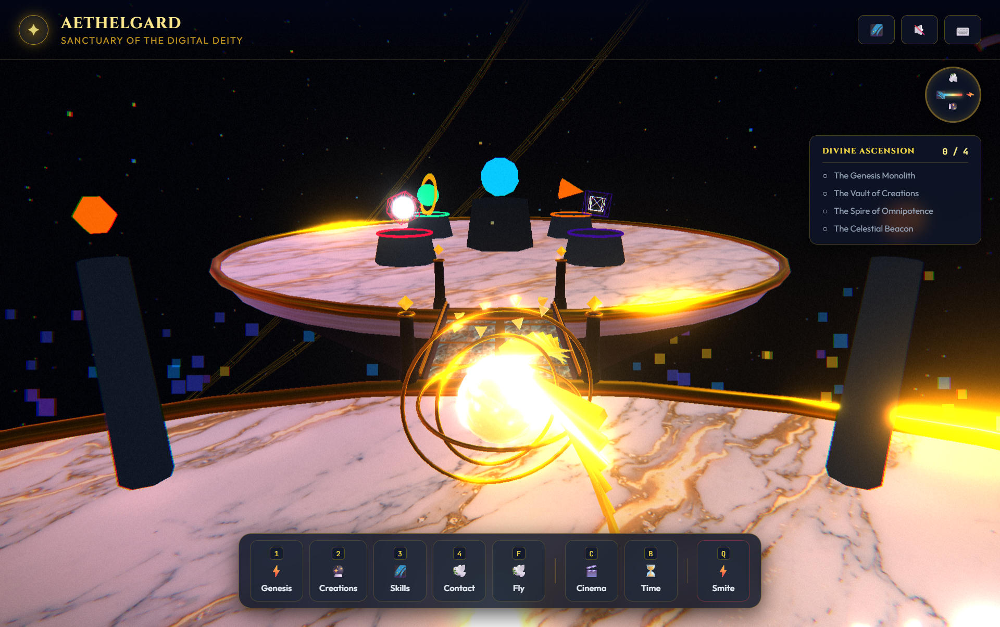
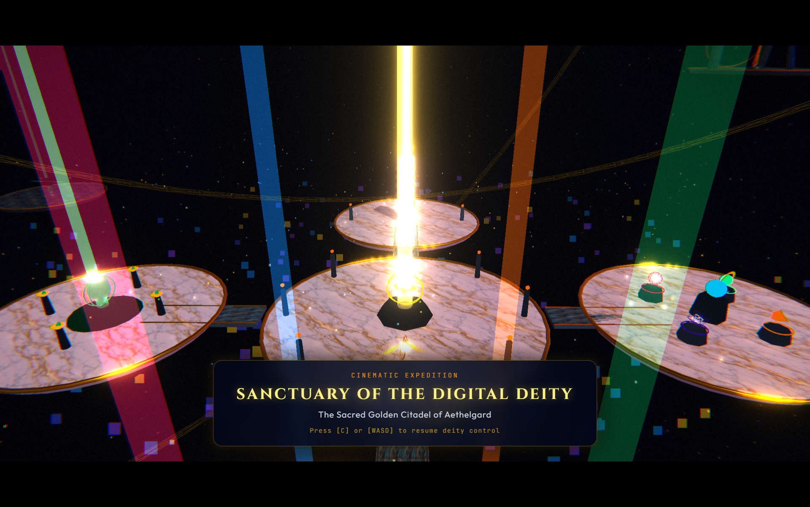

# 🌌 AETHELGARD: Sanctuary of the Digital Deity

[](https://threejs.org/)
[](https://vitejs.dev/)
[](https://www.khronos.org/webgl/)
[](https://opensource.org/licenses/MIT)

> *"Enter the sanctum of the digital heavens. You do not merely observe the cosmos—you govern it."*

**Aethelgard** is an interactive, browser-based 3D celestial web application built from the ground up to feel like a high-fidelity videogame. Stepping into the role of a digital deity, you can explore floating monolithic shrines, cast divine smites, terraform fractal landscapes, warp the day-night cycle, and embark on cinematic orbital tours.

---

## 📸 Showcase

<div align="center">
  
</div>

<br/>

| ⚡ Divine Smite Strike | 🌉 Ceremonial Causeways |
|:---:|:---:|
|  |  |

| 🎥 Cinematic Orbital Drone Tour |
|:---:|
|  |

---

## ✨ Features

### 🏛️ The Celestial Citadel & Ceremonial Causeways
- **Octagonal Sacred Platform**: Multi-tiered floating citadel with rune-inscribed golden rims, emissive conduits, and marble inlaid tiles.
- **Symmetrical Causeways**: Four 8.5m architectural bridges with golden threshold expansion plates, floating balustrade railings, underside keels, and crystalline gateway pylons.
- **The Four Cardinal Shrines**:
  - **Altar of Genesis** (*North*): Prismatic creation matrices and primordial particle vortexes.
  - **Spire of Eternity** (*South*): Towering obelisks pulsing with chronal energy.
  - **Vault of Creation** (*East*): Monolithic repositories of cosmic geometry.
  - **Beacon of Transcendence** (*West*): High-frequency resonant antennas channeling celestial ley lines.

### 🌄 Procedural Open World
- **Fractal Terrain Engine**: Real-time procedural heightmaps, dynamic chunking, and normal generation.
- **Four Distinct Biomes**:
  - *Astral Plains*: Lush, glowing flora and rolling celestial dunes.
  - *Crystal Crags*: Piercing amethyst and quartz spires refracting solar light.
  - *Starlit Caldera*: Glowing geothermal craters with incandescent mist.
  - *Void Reach*: Floating fractured earth drifting into deep space.

### ⚡ Divine Powers & Mechanics
- ⚡ **Divine Smite** (`Left Click` / `E`): Unleashes a concentrated solar beam from the sky, detonating upon impact with terrain scorch marks, expanding kinetic shockwaves, and dynamic camera shake.
- 🌋 **Terraform** (`Right Click` / `R`): Dynamically sculpt the world—raise mountain peaks or carve deep canyons directly into the terrain mesh in real time.
- ⏳ **Chronokinesis (Time Warp)** (`T`): Smoothly cycle through time, shifting from radiant golden dawn to starry midnight with dynamic celestial bodies and volumetric atmospheric fog.
- 📡 **Sanctuary Pulse** (`Q`): Emits a sweeping harmonic radar ring across the world that illuminates distant points of interest.
- 🎥 **Cinematic Drone Mode** (`P`): Autonomous cinematic fly-through camera with dynamic smooth interpolation, Dutch tilts, and variable focal sweeps.

### 🎨 Visual & Audio Pipeline
- **PBR Rendering**: Custom procedural textures for weathered marble, brushed gold, emissive runes, and terrain stratification.
- **Cinematic Post-Processing**: Custom GLSL bloom, chromatic aberration, cinematic vignettes, and ACESFilmic tone mapping.
- **100% Procedural Web Audio**: Zero external audio files. Rich polyphonic synth drone, choral resonant chords, smite thunderclaps, terraforming rumbles, and audio-reactive ambient soundscapes generated live via the Web Audio API.

---

## 🎮 Controls

| Action | Input |
|:---|:---|
| **Move** | `W` / `A` / `S` / `D` |
| **Ascend / Jump** | `Space` |
| **Descend** | `Shift` (in Flight mode) |
| **Look / Turn** | Mouse (Pointer Lock) |
| **Toggle Flight / Godmode** | `F` |
| **Sprint / Boost Flight** | Hold `Shift` |
| **Cast Divine Smite** | `Left Click` or `E` |
| **Terraform (Raise/Lower)** | `Right Click` or `R` |
| **Cycle Day / Night** | `T` |
| **Sanctuary Radar Ping** | `Q` |
| **Cinematic Drone Tour** | `P` |
| **Toggle Cinematic Letterbox** | `C` |
| **Toggle UI Overlay** | `H` |
| **Interact / Inspect** | `V` |

---

## 🚀 Quickstart

### Prerequisites
- [Node.js](https://nodejs.org/) (v18.0.0 or newer)
- Modern web browser with WebGL 2.0 support (Chrome, Edge, Firefox, Brave, Safari)

### Installation
```bash
# Clone the repository
git clone https://github.com/MagnusDrake/aethelgard.git

# Enter project directory
cd aethelgard

# Install dependencies
npm install

# Launch local development server
npm run dev
```

Open your browser and navigate to `http://localhost:5173`.

### Production Build
```bash
npm run build
npm run preview
```

---

## 📁 Architecture & File Structure

```
aethelgard/
├── public/
│   ├── favicon.ico
│   └── screenshots/              # Showcase and hero images
│       ├── hero_aerial.png
│       ├── causeway_view.png
│       ├── smite_action.png
│       └── drone_tour.png
├── src/
│   ├── audio/
│   │   └── audio-system.js       # Procedural Web Audio synthesizer engine
│   ├── effects/
│   │   ├── cinematic.js          # Camera shake, letterbox, and drone tours
│   │   ├── particles.js          # Particle vortices, smite rings, and embers
│   │   └── postprocessing.js     # Custom GLSL shaders and tone mapping
│   ├── game/
│   │   ├── constants.js          # Spatial coordinates, speeds, and configs
│   │   ├── controller.js         # Input handling and interaction state
│   │   └── player.js             # Player physics, collision, and flight
│   ├── ui/
│   │   ├── hud.js                # Minimalist deity HUD and status readouts
│   │   └── style.css             # Glassmorphism and typography
│   ├── world/
│   │   ├── citadel.js            # Monoliths, shrines, and ceremonial causeways
│   │   ├── environment.js        # Skybox, sun, moon, stars, and atmospheric fog
│   │   ├── powers.js             # Smite beam physics and terraforming logic
│   │   ├── terrain.js            # Procedural fractal terrain generation
│   │   └── textures.js           # Procedural canvas textures & bump maps
│   ├── main.js                   # Main application loop and scene bootstrap
│   └── style.css                 # Base resets and viewport styles
├── index.html                    # Application entrypoint
├── package.json
└── vite.config.js
```

---

## 🛠️ Built With

- [Three.js](https://threejs.org/) - 3D scene graph, math library, and WebGL rendering engine
- [Vite](https://vitejs.dev/) - Next-generation frontend tooling and rapid HMR
- [Web Audio API](https://developer.mozilla.org/en-US/docs/Web/API/Web_Audio_API) - Native synthesized procedural soundscapes

---

## 📜 License

This project is licensed under the [MIT License](LICENSE).
